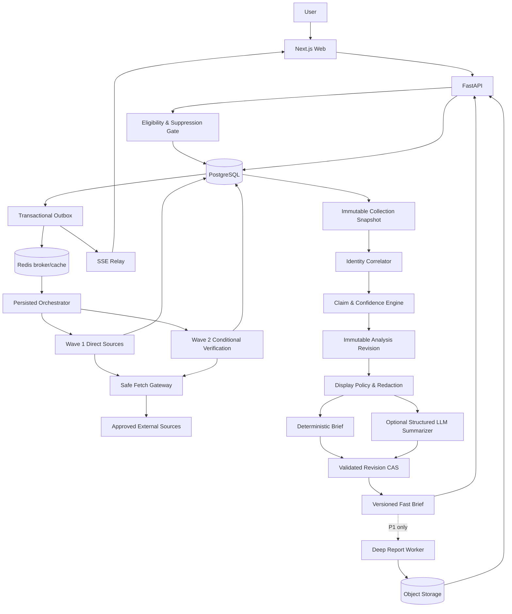

# Public Profile Search Website — Project Plan

> **For Hermes:** 实施时先读取 `public-profile-osint`、`writing-plans`、`test-driven-development`；按本文的阶段与验收门执行。判断性工作交给模型，抓取、状态机、存储、超时、置信度规则和安全边界由宿主应用确定性控制。

**目标：** 邀请制用户在完成 self-audit 主页控制权验证或命中受控人工 allowlist 后，输入一个允许域名上的公开职业/创作者主页 URL，并以 60–120 秒为内部目标得到带来源、证据强度与限制说明的 Fast Brief。该时限在 Phase 1 基准通过前不得作为对外承诺。MVP 不提供自由用户名搜索、第三方 consent workflow、招聘筛选、Deep Report 或 PDF；这些能力只有通过单独的质量、安全与合规门后才进入 P1。

**架构：** Next.js 前端通过 FastAPI 创建异步搜索任务，以 SSE 接收可重放进度。PostgreSQL 是任务与证据控制面的唯一事实源，Redis 只作 broker/cache。后端通过安全抓取网关和分波次 provider fan-out 收集公开证据，先冻结只含 observations 的不可变 collection snapshot，再生成不可变 analysis revision；LLM 只基于已批准 claim 生成可选文案，确定性模板始终可交付。

**建议技术栈：** Next.js + TypeScript、FastAPI + Python、Redis + Celery、PostgreSQL、S3-compatible object storage、Playwright/Headless Chrome、pytest、Vitest、Playwright E2E。

**文档定位：** 本文是产品、架构、交付与上线门的唯一版本化计划。provider contract、evidence schema、policy version 和 benchmark 报告在代码仓库中版本化；Vault 副本只作索引，不作为实施事实源。

### v2.1 Claude Opus review 修订摘要

- 将 Phase 1 的 50+50 数据集明确为 feasibility gate，不再伪装成 99% precision 的统计证明；自动展示门改为按 predicate 单独报告一侧 95% 误差上界。
- 给 `minimum useful brief`、`evidence quorum` 与 precision–yield frontier 唯一定义。
- 将 collection cutoff 前移到 80 秒，并为 correlation、policy、deterministic report、可选 LLM 与 terminalization 分配内部预算。
- 将通用搜索 API 改成 Phase 0 单独审批的可选增强；MVP 必须存在只依赖第一方/官方/学术来源的 Wave 2 fallback。
- 将第三方 verified-consent 流程、`/consent/:token` 与相关 issuance 从 MVP 推迟到 P1。
- consequential 跨账号事实只有 `confirmed` 明确互链账号才能并入主体事实；`likely` 只作为带限定语的关联提示。
- 增加 prose→claim 语义边界、restore 后 suppression/tombstone replay、HMAC suppression 覆盖边界、成本熔断、history API 与 contract codegen。

### v2.0 修订摘要

- 将 MVP 固定为邀请制、URL-first、Fast Brief only。
- 将招聘筛选、自由用户名搜索、Deep Report 和 PDF 移出 MVP。
- 将 provider 合规、隐私、安全、保留期和主体权利前置为 Phase 0 阻塞门。
- 用可量化的身份准确性、证据支持、安全泄漏、成本与并发指标替代“多数”“稳定”等模糊门。
- 引入 retry-safe `JobAttempt` / `ProviderRun`、durable event、不可变 collection snapshot、analysis revision 和 report revision。
- 将横向分层开发改为先完成 2–3 个来源的端到端 vertical slice，再按边际价值扩展 provider。

---

## 1. 产品判断

### 1.1 核心结论

这个产品以 **1–2 分钟交付关键结果** 为内部目标，但只有在 Phase 1 的基准测试同时证明延迟、身份精度、证据支持度、安全与单次成本后才能对外承诺。产品拆成：

1. **Fast Brief**：60–120 秒硬截止，交付关键事实、可信度、来源和限制。
2. **Deep Report（P1）**：Fast Brief 产品通过邀请制试点后，才评估是否提供更深核验；PDF 不是默认交付形态。

网站不应把整个 Hermes skill 暴露成一个同步 API。正确形态是：

- 并行证据收集器
- 目标资格与策略门
- 安全抓取网关
- 身份候选聚类器
- 证据与事实模型
- 可解释置信度引擎
- 结构化摘要生成器
- 可选异步深度报告器（P1）

### 1.2 为什么现有流程耗时

当前 `public-profile-osint` 流程包含：

- 大范围 Maigret 扫描
- 递归用户名 pivot 与假阳性清理
- LinkedIn / 学校 / 雇主 /论文的补充检索
- 官方来源与 DOI 交叉核验
- B站、微博、小红书、抖音覆盖
- 头像素材比较
- HTML/PDF 生成
- PDF 页数、文本、布局与浏览器进程验证

这些步骤适合审计级报告，不适合阻塞首屏。

### 1.3 产品北极星

> 用户在 2 分钟内得到“这个公开主页能可靠支持哪些人物事实、为什么、哪些仍未知，以及何时系统选择 abstain”的答案。

不是：

- 给出一堆未验证账号链接
- 把同名者拼成一个人
- 声称覆盖“全网”
- 以敏感联系方式作为卖点
- 让模型从原始网页自由编故事

---

## 2. 用户与使用场景

### 2.1 MVP 主要用户与目标边界

- 已验证目标主页控制权、希望检查自己公开职业足迹，且通过人工成年/范围复核的账号所有者
- 仅在人工 target allowlist 中的成年公共职业人物；不能由搜索者自行声称目标“具有公共身份”
- 需要证据链接，而不是只要模型判断的用户

MVP 只接受 allowlist 平台上的直接公开主页 URL，并采用默认拒绝。系统不得从任意用户名开始全网枚举，也不得接受目标登录凭据。只有以下内部 eligibility 状态可以启动 fan-out：

```text
eligible_verified_self
eligible_manual_public_allowlist
```

`unreviewed`、`age_unknown`、`ineligible`、`policy_blocked` 或 `suppressed` 均不得继续。eligibility 在 pre-fetch、pre-persist 和 pre-display 三处重新检查；外部只返回统一 `result_unavailable`。

### 2.2 典型场景

1. 输入 GitHub、Medium 或其他固定 allowlist 平台的公开主页 URL，核对该主页主动关联的跨平台账号。
2. 查看明确公开的职业、教育、项目与研究方向。
3. 对某项结论展开查看原始来源、证据强度、有效时间与关联逻辑。
4. 当 eligible 目标证据不足或互相冲突时得到 `insufficient_evidence`；目标不符合资格时只得到统一 `result_unavailable`。

### 2.3 不支持的用途

- 搜索或暴露电话号码、个人邮箱、家庭地址
- 绕过登录、验证码、付费墙或私密账号
- 人脸识别、反向人脸搜索或生物特征匹配
- 近似头像、人像或其他生物特征的跨站匹配
- 批量枚举、跟踪、骚扰或监控个人
- 搜索未成年人或高风险弱势群体
- 用作招聘筛选、就业资格、信用、保险、住房、教育录取、移民、执法或法律身份裁决
- 将结果表示为背景调查、法律认证或事实保证
- 推断或展示宗教、政治倾向、性取向、性别认同、族裔、残障、医疗、工会、移民身份或其他敏感属性
- 将生产查询、job、资料主体或抓取来源数据用于模型训练、微调或事后扩充评测集；独立招募并明确授权的 benchmark participant 不属于生产数据

---

## 3. MVP 范围

### 3.1 必须交付

1. **单个直接 URL 输入**
   - allowlist 中的单个公开职业/创作者主页 URL
   - URL 必须经过安全抓取校验与目标资格策略
   - 自由用户名搜索在 P1 重新评估
   - MVP 不支持 email、手机号、图片

2. **异步任务**
   - 创建任务后立即返回 `job_id`
   - SSE 推送进度
   - 支持刷新页面后继续查看

3. **Fast Brief**
   - 公开姓名与昵称
   - 明确公开且有时间语义的职业信息
   - 教育路径
   - 技能、项目、研究或内容方向
   - 用户可见 `explicitly_linked` / `likely_same_public_account`；内部模糊与排除候选不展示
   - 身份关联理由
   - 来源链接
   - 渠道限制
   - 证据不足或统一 `result_unavailable` 说明

4. **证据可解释性**
   - 每条 claim 可展开查看 supporting / contradicting sources
   - 显示 source type、抓取时间、可信度
   - 显示为什么账号达到相应 association 等级，但不暗示现实身份认证

5. **60–120 秒硬截止**
   - 超时来源不阻塞结果
   - collection deadline 早于用户可见 deadline，必须为关联、策略检查和模板输出预留时间
   - 只有达到 §3.1.1 canonical minimum useful brief 才进入 `ready_partial`
   - 否则进入 `insufficient_evidence`，不得用空结果满足 SLO

6. **隐私、主体权利与滥用控制**
   - 邀请制登录、目的声明、限流、审计日志
   - 不展示敏感联系方式
   - 搜索者删除历史与资料主体 correction / dispute / suppression 为独立流程
   - suppression 必须阻止已登记 known identifiers 对应的缓存、新任务和迟到 worker 重新生成，并明确未知平台/alias 的覆盖边界

#### 3.1.1 Minimum useful brief（canonical definition）

`minimum useful brief` 是 `fast-brief-v1` completeness policy 的版本化、唯一规范。它必须同时满足：

1. displayed subject 只能是已经通过 eligibility 的输入主页本身；不能用候选账号替换主体。
2. 至少一个非敏感 claim 通过 predicate/value DisplayPolicy、freshness 和 evidence gate；仅有“找到一个页面/账号”不算有用 brief。
3. 每个展示 claim 均有可点击 source URL、observation span/excerpt、source type、retrieved/asserted time 和 claim confidence。
4. consequential claim 满足 §9.5；来自跨账号的 consequential claim 只有账号 association 为 `confirmed` 时才能并入主体事实。
5. limitations 明确列出未完成、受限、冲突或未核验的来源类别，且 summary/evidence drawer 不含禁止属性。
6. policy、redaction、citation/prose entailment 与 immutable revision 校验全部通过。

任一条件不满足即进入 `insufficient_evidence`；不得通过降低 claim threshold、把 `likely` 写成确定事实或仅展示渠道状态来满足 SLO。其他章节只引用本定义，不另造变体。

### 3.2 MVP 非目标

- 500+ 站点全量扫描
- 批量上传 ID
- 公共 API
- 自由用户名搜索
- 复杂团队协作与 RBAC
- 自动联系目标人物
- 实时持续监控账号变化
- 付费墙、登录态和验证码自动化
- 人脸识别
- 头像近似匹配
- Deep Report 与 PDF
- 移动端原生 App
- 多语言完整本地化；MVP 先中英双语摘要模板

### 3.3 P1 / P2

**P1**

- 第三方 verified-consent research flow，包括短期 consent link、主页控制权验证与撤回
- 通过额外质量与安全门后的用户名搜索
- Deep Report（在线报告或 PDF 由 P1 review 决定）
- 结果对比与历史版本
- 可选的来源重新扫描
- 用户提交“这个候选是/不是同一人”反馈；仅进入复核队列，不能直接覆盖 evidence
- 更多专业来源 adapter
- 付费额度与任务优先级

**P2**

- 组织/公司实体调查
- 团队 workspace
- 结果分享与到期链接
- Webhook / API
- 多语言 UI

---

## 4. 用户体验与 SLA

### 4.1 页面

1. `/` — 输入与产品说明
2. `/eligibility` — self-control verification 与人工复核状态
3. `/search/:job_id` — 实时进度与 Fast Brief
4. `/history` — 用户自己的历史任务
5. `/privacy` — 数据处理、资料主体 correction / dispute / suppression
6. `/terms` — 使用限制与禁止用途

P1 才增加 `/report/:report_id`。

### 4.2 Progressive disclosure

建议状态文案：

```text
00:03  正在检查输入与访问策略…
00:14  正在读取公开主页…
00:31  正在核对主页主动关联的公开来源…
00:48  正在检查来源独立性与时间信息…
01:06  正在处理冲突与证据不足项…
01:22  关键摘要已生成
```

不要展示：

- 内部 provider 名称
- 原始 prompt
- API key / cookie 状态
- 大量 scanner 噪声
- 尚未通过身份聚类的敏感片段
- 尚未通过策略、redaction 与 finalization 的姓名、候选账号或事实

### 4.3 延迟目标

| 阶段 | 目标窗口 | 交付 |
|---|---:|---|
| 请求受理与策略门 | 0–3 秒 | `job_id`、安全 URL 规范化、目标资格初检 |
| Wave 1 直接证据 | 3–30 秒 | 输入主页及其主动关联来源 |
| Wave 2 条件核验 | 锚点就绪后启动，通常 15–75 秒 | 可与 Wave 1 pipeline 重叠；仅核验已出现的姓名、组织、教育或论文锚点 |
| Evidence finalization | 达到 quorum 或最迟 80 秒 | 冻结只含 accepted observations 的 immutable collection snapshot |
| Correlation 与 claim build | 最多 10 秒 | 目标 80–90 秒完成 |
| Policy、redaction、completeness 与 deterministic report | 最多 10 秒 | 目标 90–100 秒完成；此时已有可交付 fallback |
| 可选 LLM 文案 | 最多 10 秒 | 目标 100–110 秒；超时或越界立即丢弃 |
| CAS、event 与 terminalization | 最多 5 秒 | 目标 110–115 秒完成 |
| Watchdog 安全余量 / 硬截止 | 115–120 秒 | 120 秒前进入终态 |

### 4.4 SLO

MVP 邀请制试点目标；最终数值必须由 Phase 1 benchmark 报告确认，不能在没有基线时向外承诺：

- **Terminalization latency SLO：** 分母为通过 admission 与 pre-fetch eligibility、已返回 job ID 的请求；在声明的并发与冷缓存条件下，至少 90% 在 120 秒内得到 `ready`、`ready_partial`、`insufficient_evidence` 或系统终态。无效输入、同步 `429/503` 与 `policy_blocked` 单独统计
- **Useful-brief yield / latency：** 分母为 benchmark 预先标注为“在当前 provider/policy 范围内可解析”的 eligible cohort；分别报告在 120 秒内得到 `ready / ready_partial` 的比例与延迟。合法 no-match / unresolvable cases 不进入该分母，而以 `insufficient_evidence` 判定准确率单独评估
- `failed` 虽可满足 terminalization latency，但不计入 useful yield；system failure rate 必须低于 Phase 0 冻结的 error budget
- `ready` 表示 versioned completeness policy 的 required source classes 和全部展示 claim gate 均满足；optional provider failure 不自动使结果变为 partial
- `ready_partial` 必须满足 §3.1.1 的 canonical `minimum useful brief`。`likely` 跨账号只可作为带限定语的关联提示，其事实不能并入主体 consequential claim；后者要求 association 为 `confirmed`。否则只能是 `insufficient_evidence`
- 从任务受理开始计算 queue-inclusive P50/P90/P95，不从 worker 开始执行计算
- `confirmed` 账号关联在盲测 holdout 上不得出现已知 false merge；公开发布前还需使用足够大的样本给出 false-merge 上界
- consequential claim 分别报告 precision、recall / abstention、citation entailment 与 freshness，不以“有 source ID”代替“来源支持结论”
- 敏感字段或禁止属性泄漏率必须为 0；任何命中都阻塞发布
- 每条 consequential claim 默认需要两个独立 provenance group；单一索引或同源转载只能保留为内部 lead，不得展示为降级事实
- 每个 provider failure 必须映射为结构化状态，不允许静默消失
- 任务失败、证据不足或 `result_unavailable` 时，用户能看到可理解且不泄露内部策略细节的说明
- 同时记录每单 provider 调用数、浏览器秒数、LLM token 与总成本，并在 Phase 1 确定可接受上限

---

## 5. 系统架构



**Storage boundary：**

- PostgreSQL 保存 job、attempt、provider run、结构化证据、collection snapshot、analysis/report revision 与 durable event，是唯一控制面事实源。
- Redis 只用于 Celery broker、短期 cache、rate-limit 和 event transport；Redis 丢失不得改变最终任务状态。
- Object storage 只保存短期受限的原始调试对象和 P1 report artifact。
- Python / TypeScript 共用版本化 JSON Schema / OpenAPI contract，避免手写双份状态与 evidence 类型。

### 5.1 宿主应用与模型的责任边界

**宿主应用负责：**

- 输入校验与规范化
- URL 安全解析、allowlist、SSRF 防护与目标资格检查
- provider fan-out
- at-least-once delivery 下的幂等、超时、重试、熔断、速率限制
- 原始证据存储
- source lineage、collection snapshot、candidate/claim analysis revision 与 report finalization
- claim schema 校验
- 置信度规则
- predicate allowlist、redaction、suppression 与展示策略
- 文件路径与 P1 PDF 写入
- 任务状态机
- durable job event / SSE replay
- 审计日志

**LLM 负责：**

- 为宿主已选定且可展示的单一候选生成简洁摘要
- 对冲突来源生成中立描述
- 输出严格 JSON，不直接写数据库或文件

**禁止：** 让模型读取未过滤原始网页后直接返回最终事实；创建 schema 外 claim；决定目标资格、置信度、来源独立性、redaction 或 suppression；绕过来源失败；直接写数据库、文件或调用 provider。

### 5.2 调度、截止与 finalization

- Celery 视为 at-least-once delivery；所有 task 使用稳定 `logical_run_id`、数据库唯一约束和幂等写入。
- `accepted_at` 是 SLO 起点，同时按当前 `completion_policy_id` 冻结下列默认值；它们不是运行中可漂移的全局常量，任何调整都需要 policy version bump 与 benchmark：
  - `collection_cutoff_at`：默认 80 秒，停止启动/接受 Fast Brief 新证据。
  - `fallback_at`：默认 110 秒，仍未完成时强制使用确定性摘要。
  - `deadline_at`：默认 120 秒，任务必须进入终态。
- `evidence quorum` 是 execution-completion 条件，不是 evidence-quality 条件。`fast-brief-v1` completion policy 必须版本化声明 `required_for_finalization` source classes；当输入主页成功完成，且本次 planning manifest 中所有 required ProviderRun 到达 canonical terminal status 时，即达到 quorum。optional run 不阻塞；`ready / ready_partial / insufficient_evidence` 仍由 completeness policy 独立决定。
- orchestrator 不依赖“全部成功”的 Celery chord。持久化 finalizer 在 planning manifest 全部终态、evidence quorum 达成或 collection cutoff 时运行。
- API 在一个数据库事务中创建 SearchJob、唯一 JobAttempt、planned ProviderRuns、初始 JobEvent 和 dispatch outbox commands；outbox dispatcher 再向 Redis/Celery 投递，禁止 DB + broker dual write。
- Wave 2 等动态规划也必须在一个事务中创建 conditional ProviderRun 与 dispatch outbox command，并使用唯一 planning/idempotency key；事务必须比较 planning 开始时的 `acceptance_epoch`，epoch 已变化或 snapshot 已冻结时放弃创建。不能直接从 worker 向 broker 裸投递。
- DB reconciler 定期重新投递 queued / unleased / lease-expired runs，Redis 丢失或 worker crash 后仍能恢复。
- deadline watchdog 使用数据库时间和 row lock 扫描到期 job，独立于 Celery callback 强制触发 collection cutoff、fallback 与 terminalization。
- finalization transaction 在 quorum 或 cutoff 时把所有未终态 ProviderRun 设为 `closed_at_finalization`、递增 acceptance epoch，并冻结 collection snapshot；analysis revision 只引用一个 collection snapshot。
- finalizer 使用 compare-and-swap，只允许一个 current analysis revision 与 report revision。
- collection snapshot 冻结或 acceptance epoch 改变后，worker 不得提交 evidence payload。它只能通过独立 status-only audit path 完成 ProviderAttempt（状态、耗时、错误、计数），payload 立即丢弃并标记 `late_payload_discarded`；未来 revision / P1 必须重新抓取，不能复用迟到内容。
- `/retry` 创建带 `retry_of_job_id` 的新 job，不把终态 job 倒退。
- state 更新与 `JobEvent` 写入同一数据库事务；outbox relay 再发布到 SSE。

### 5.3 Queue 与 backpressure

MVP 区分以下 queue；可以复用同一 container image，但至少使用独立 worker process/pool，才能分别执行 concurrency、memory 和 kill-switch：

- `fast_http`
- `fast_browser`
- `correlator`
- `summarizer`
- `maintenance`
- `deep_report`（P1，独立低优先级）

每个 queue 有独立 concurrency、内存预算和 overload policy；每个 provider 有 token bucket、`Retry-After`、circuit breaker、kill switch 和 dead-letter 上限。admission control 同时执行 per-user 与全局 daily-spend、LLM token、browser-second 和 provider-call budget；达到软上限先关闭 optional Wave 2/LLM，达到硬上限则拒绝新 job 并触发 cost kill switch。若判断无法在 queue 或成本 budget 内启动，API 在创建 job 前返回 `429` / `503` 与 `Retry-After`；不允许无限堆积后仍声称满足 120 秒 SLO。

---

## 6. 数据源与扫描策略

### 6.1 Provider 准入门

任何 provider 进入代码或 live benchmark 前，必须在 `docs/provider-matrix.md` 记录：

- 状态：`approved_for_limited_evaluation` / `approved_for_mvp` / `deferred` / `rejected`
- 允许的访问方式、展示字段、excerpt、缓存与商业使用范围
- 登录、验证码、robots / rate-limit 边界
- 数据地区、保留期、删除行为和 subprocessor
- P50/P90 延迟、配额、估算成本、价值假设
- owner、reviewer、复审日期、kill switch 和 fallback

`approved_for_limited_evaluation` 只允许按书面 volume、retention 和 reviewer 条件运行 live probe；Phase 1 的延迟/配额/成本数据完成后才能升级为 `approved_for_mvp`。MVP allowlist 中不得存在 `TBD` 或 evaluation-only provider。需要登录、需要绕过验证码或无法满足删除/保留政策的 provider 不得进入 fan-out。

### 6.2 Wave 1：Fast Brief 直接来源

- 用户提供的原始主页
- 原始主页一跳内明确互链且已批准的公开账号；不继续递归
- GitHub、Medium 等能稳定公开访问的固定 allowlist 来源

通用公开搜索 API 不是 Wave 1 必需依赖。只有 Phase 0 对访问、人物核验用途、缓存、派生展示、商业使用、删除与地区条款给出书面批准后，才能作为 optional verification enhancer；未批准时产品仍必须运行。

Phase 1 从 2–3 个批准来源起步，不预先承诺站点数量。

### 6.3 Wave 2：条件权威核验

- 公司官网与官方博客
- 学校官网、课程目录、毕业/荣誉页面
- Crossref / DOI
- OpenAlex / Semantic Scholar，仅作候选发现
- 会议 proceedings
- 公开作品集与项目页面

MVP 必须实现不依赖通用搜索 API 的第一方 fallback：只访问由输入主页/明确互链直接提供的 authority URL、已批准 publisher 的固定 API/URL pattern、公司/学校官方站点内的已知链接，以及 DOI/Crossref/proceedings 等结构化标识符。通用搜索 API 若获批，只能核验 Wave 1 已存在的 allowlist claim / organization / publication anchor。

Wave 2 只有在 Wave 1 已产生具体身份锚点、剩余时间/成本充足、且查询能提高某个已存在 allowlist claim 的确定性时才启动；可在 Wave 1 尚有 optional run 时 pipeline 重叠，启动条件是锚点就绪而非固定时刻。不能固定全量 fan-out。禁止 name-only 人物发现、people-search directory、关系图谱、发现新身份或从搜索结果继续 pivot。

### 6.4 Deferred providers

- Instagram、LinkedIn、X、TikTok、Facebook 等登录墙或访问政策不稳定来源，逐个通过 provider gate 后才可启用
- Bilibili、Weibo、Xiaohongshu、Douyin 默认 deferred，不作为 MVP 验收要求
- Maigret 或大范围 username scanner 仅在 P1 username-search spike 中评估

Provider execution status 与 candidate identity status 必须分开：

```text
ProviderRunStatus =
  pending | leased | running | retry_scheduled |
  success | no_result | timeout | rate_limited | captcha_blocked |
  auth_required | invalid_response | provider_error |
  skipped_budget | skipped_circuit_open | closed_at_finalization | cancelled

CandidateStatus =
  confirmed | likely | unverified | excluded | quarantined

ObservationDisposition =
  accepted | duplicate | policy_filtered | suppressed

ProviderCompletionDisposition =
  in_budget | late_payload_discarded
```

一次成功 provider run 可以返回零个或多个 candidate，每个 candidate 各有状态。finalization 后未完成的 logical run 保持 `closed_at_finalization`；随后完成的任何 generation 只能追加 completion disposition `late_payload_discarded`，不创建 SourceObservation，也不能把 ProviderRun 改为 `success`。不能把 `timeout`、`captcha`、`auth_required`、预算跳过或缺少工具翻译成 `no_result` / `no account`。

### 6.5 P1 username scanner 规则

- 只有 Phase 7 Fast Brief production gate 通过、且完成独立 P1 product/safety decision 后才进行单独 spike
- 先从 5–8 个批准的高价值站点开始，只有边际召回、延迟、成本与安全指标支持时才扩大
- 默认禁止递归 pivot
- 第三方搜索永不自动递归；Deep Report 也需显式预算和策略批准
- root identifier 与 child identifier 必须分别存储
- pivot source 未确认前，child branch 状态为 `quarantined`
- 常见短别名（如 `delia`）默认不进入递归
- scanner 只能发现 candidate，不能直接生成职业/身份结论

---

## 7. 任务状态机

```text
queued
  → running
  → finalizing
  → ready | ready_partial | insufficient_evidence

queued | running | finalizing
  → policy_blocked | failed | cancelled

任一终态
  → deleting
  → deleted
```

语义：

- `queued → running`：durable `JobAttempt` 已创建，任务才可对外显示运行中。
- `running → finalizing`：planning manifest 中所有 required provider 已终态、达到 §5.2 execution quorum，或触发 `collection_cutoff_at`。
- `finalizing → ready`：版本化 completeness policy 返回 `complete`，且 collection snapshot、analysis revision、policy check 与 brief 均成功。
- `finalizing → ready_partial`：completeness policy 返回 `usable_partial`，且满足 §3.1.1 canonical minimum useful brief。
- `finalizing → insufficient_evidence`：无法安全支持有用 brief；这不是系统错误。
- `policy_blocked`：内部表示 target eligibility、suppression 或展示策略阻止结果；外部统一映射为 `result_unavailable`，不得泄漏具体风险标签。
- 任一非终态可进入 `cancelled`；worker 在外部调用前和数据库 commit 前都检查 cancellation、suppression 与 `acceptance_epoch` write fence。
- 删除使用 `terminal → deleting → deleted`，并先写 tombstone，保证 queue retry / late worker 不能恢复数据。
- `failed` 仅表示不可恢复的系统错误；provider 缺失、没有匹配或证据不足不得映射为 `failed`。

精确阶段进度使用 monotonic milestones 和 `terminal_provider_runs / planned_provider_runs`，不使用伪精确 `progress_percent` 或单一 `current_step`。

### 7.1 Provider run 状态

使用 §6.4 的 canonical `ProviderRunStatus`：

```text
pending → leased → running
running → success | no_result | retry_scheduled | timeout | rate_limited |
          captcha_blocked | auth_required | invalid_response | provider_error | cancelled
retry_scheduled → leased
leased | running -- lease expired --> retry_scheduled
pending → skipped_budget | skipped_circuit_open | cancelled
pending | leased | running | retry_scheduled -- finalization --> closed_at_finalization
```

`pending`、`leased`、`running`、`retry_scheduled` 非终态，其余为终态。lease reclaim 将旧 ProviderAttempt 标记 `abandoned_lease_expired`、递增 `lease_generation` 并创建 retry schedule。每次 retry 保留不可变 attempt history，不覆盖前一次错误；`retry_scheduled` 必须包含 `retry_at` 与原因。

### 7.2 SSE event contract

- 每个 job 的 `sequence` 单调递增，数据库唯一约束为 `(job_id, sequence)`。
- 客户端用 `Last-Event-ID` 重放；重复 event 必须无害。重放始终从 PostgreSQL `JobEvent` 读取，Redis/pubsub 只负责热路径转发；Redis 丢失不能造成 event gap。
- relay 定期发 heartbeat；断线或 token 到期后，客户端先 `GET /job` 对账再恢复。
- SSE 只发送阶段、计数、安全文案和终态，不发送未 finalization 的候选人物片段。
- 原生 `EventSource` 使用安全 same-site session cookie；若部署拓扑不能满足，则使用短期 stream token 或 fetch-based SSE，并在 ADR 中冻结。

### 7.3 深度报告状态（P1）

```text
not_requested
queued
researching
rendering
validating
ready
failed
cancelled
expired
deleting
deleted
```

### 7.4 Wire status 与 UI glossary

内部状态不直接作为产品文案：

| 内部类型 | Wire / UI |
|---|---|
| job `ready` | `complete` |
| job `ready_partial` | `partial` |
| job `insufficient_evidence` | `insufficient_evidence` |
| job `policy_blocked` | `result_unavailable` |
| job `failed` | `service_error` |
| account `confirmed` | `explicitly_linked` |
| account `likely` | `likely_same_public_account` |
| account `unverified / excluded / quarantined` | 不展示 |

Claim confidence (`high / medium_high / ...`) 与 account association、job outcome 是不同 enum，API schema 和 UI 不得混用。eligibility、suppression、minor 或安全策略阻止始终对外为 `result_unavailable`；只有证据不足/歧义才是 `insufficient_evidence`。

---

## 8. 核心数据模型

模型通过迁移、JSON Schema 与唯一约束表达以下实体。示例字段是最低要求，不是最终 ORM 定义。

### 8.1 SearchJob 与 JobAttempt

```jsonc
{
  "SearchJob": {
    "id": "uuid",
    "user_id": "uuid",
    "retry_of_job_id": null,
    "canonical_input_url_ciphertext": "encrypted",
    "input_type": "profile_url",
    "normalized_identifier_hmac": "versioned keyed HMAC",
    "normalization_version": "1",
    "status": "running",
    "active_attempt_id": "uuid",
    "accepted_at": "UTC timestamp",
    "collection_cutoff_at": "UTC timestamp",
    "fallback_at": "UTC timestamp",
    "deadline_at": "UTC timestamp",
    "completion_policy_id": "fast-brief-v1",
    "policy_version": "2026-07-23",
    "row_version": 4,
    "acceptance_epoch": 1,
    "cancelled_at": null,
    "deleted_at": null
  },
  "JobAttempt": {
    "id": "uuid",
    "job_id": "uuid",
    "attempt_no": 1,
    "status": "running",
    "collection_snapshot_id": null,
    "current_analysis_revision_id": null,
    "current_report_revision_id": null,
    "started_at": "UTC timestamp",
    "finished_at": null,
    "terminal_reason": null
  }
}
```

MVP 中每个 `SearchJob` 恰好一个 `JobAttempt`，数据库对 `job_id` 设唯一约束；它是 planned provider runs、orchestrator lease 和 finalization 的执行容器。MVP 不实现 multi-attempt transition、attempt retry UI 或 attempt selection；该实体只为 P1 rescan/多执行语义预留稳定边界。Redis/Celery requeue 不创建新 JobAttempt，transient provider retry 只创建 `ProviderAttempt`。用户 retry、P1 rescan 或重新分析创建新 SearchJob / revision，不复用旧 job 的 state machine。

SearchJob 拥有对外 canonical status；JobAttempt 只记录 execution status 与 terminal reason，两者在同一事务更新，不能各自独立迁移。

### 8.2 ProviderRun 与 ProviderAttempt

`ProviderRun` 表示一次逻辑查询，包含 `attempt_id`、provider、versioned keyed-HMAC query fingerprint、`logical_run_id`、canonical status、deadline、retry count、`lease_generation`、lease expiry、result counts 与 error code。`ProviderAttempt` 逐次保存 generation、开始/结束时间、completion disposition、响应摘要、错误与重试决定，不能覆盖历史。

`(attempt_id, logical_run_id)` 和 provider-specific idempotency key 必须唯一。worker evidence commit 必须同时匹配当前 `lease_generation` 与 `acceptance_epoch`，并核对终态、删除 tombstone 与 suppression；只有 finalization、cancel、delete、suppression 会递增 acceptance epoch。普通 provider/progress 写入不得使其他合法并发结果失效；`row_version` 只用于 lifecycle/finalizer CAS。过期 generation 或 epoch 只能写 append-only status audit，不能写 evidence 或覆盖 ProviderRun 当前状态。

### 8.3 SourceDocument 与 SourceObservation

```jsonc
{
  "SourceDocument": {
    "id": "uuid",
    "canonical_url": "https://...",
    "publisher": "example.org",
    "title": "...",
    "mime_type": "text/html",
    "content_hash": "sha256",
    "lineage_key": "canonical upstream source"
  },
  "SourceObservation": {
    "id": "uuid",
    "provider_run_source_use_id": "uuid",
    "document_id": "uuid",
    "source_type": "self_description",
    "trust_class": "self_reported",
    "retrieved_at": "UTC timestamp",
    "published_at": null,
    "asserted_at": null,
    "effective_from": null,
    "effective_to": null,
    "excerpt": "...",
    "span_locator": {},
    "extraction_version": "1",
    "expires_at": "UTC timestamp"
  }
}
```

`SourceDocument` 以 `(canonical_url, content_hash)` 版本化唯一；同一 URL 内容变化时创建新 document。

共享 cache 另建 `RetrievalArtifact`，保存 document、retrieval metadata、cache scope（global / tenant）、受限 `raw_object_key` 和独立 expiry。每个 job 通过 `ProviderRunSourceUse` 记录使用了哪个 artifact、cache hit/miss、当时的 suppression/policy check 和 ownership scope；SourceObservation 属于该 per-job use。job deletion 与 subject suppression 分别清理 per-job provenance 和受影响 shared artifact，不能因 cache 复用失去可追溯性。

`retrieved_at` 只说明何时抓取，不能单独支持“当前”结论。共享 `lineage_key` 的搜索摘要、镜像与原始记录只算一个 provenance group。

### 8.4 CandidateCluster 与 AccountCandidate

- `CandidateCluster` 属于一个 `AnalysisRevision`，保存展示候选、解释规则版本与 ambiguity reason。
- `ClusterMembership` 连接 analysis revision、cluster、account candidate、candidate status 与正/负 evidence observation；同一 candidate 可在后续 revision 重新聚类。
- `AccountCandidate` 只属于 job/attempt，必须有独立 ID、canonical platform/handle/URL 与 observation links；不能直接保存 cluster foreign key 或最终 status。
- unverified、excluded、quarantined candidate 仅用于内部消歧，不进入用户可见 summary 或 evidence drawer。

### 8.5 Claim 与 ClaimEvidence

```jsonc
{
  "Claim": {
    "id": "uuid",
    "analysis_revision_id": "uuid",
    "candidate_cluster_id": "uuid",
    "predicate": "education.public_program_or_degree",
    "predicate_schema_version": "1",
    "value": {},
    "normalized_value_hmac": "versioned keyed HMAC",
    "confidence": "medium_high",
    "valid_from": null,
    "valid_to": null,
    "as_of": null,
    "displayable": true,
    "policy_reason": "allowed predicate"
  },
  "ClaimEvidence": {
    "claim_id": "uuid",
    "observation_id": "uuid",
    "relation": "supports",
    "independence_group": "source-lineage-key",
    "excerpt_or_span": {},
    "rationale": "..."
  }
}
```

禁止在 Claim 中保存 source ID 数组；join record 必须表达 `supports` / `contradicts`、证据片段、理由与独立来源组。每个 ClaimEvidence observation 必须属于该 analysis revision 引用的 collection snapshot，validation / foreign-key-like invariant 拒绝跨 snapshot 引用。

### 8.6 CollectionSnapshot、AnalysisRevision、ReportRevision 与 JobEvent

- `EvidenceCollectionSnapshot`：attempt ID、cutoff time、被接纳 observation IDs、provider-run terminal manifest、collection policy version 与 checksum；创建后不可变，不包含 cluster 或 claim ID。未接纳 observation 的 disposition 保存在 per-job source-use record。
- `AnalysisRevision`：恰好引用一个 collection snapshot，保存 candidate cluster、claim、correlator/rules/display-policy version、completeness result 与 checksum；创建后不可变。
- `ReportRevision`：恰好引用一个 analysis revision，保存 type、status、locale、schema/policy/prompt/model/template version、checksum、generation timestamps、limitations 与 failure code；内容不可变。MVP type 只有 `fast_brief`。
- `ReportAccessState`：与 immutable report 分离，取值 `active | revoked_policy | revoked_suppression | expired | deleted`。所有 brief/evidence/read/download 路径必须实时检查；紧急下架先 revoke，异步清理随后执行。
- `JobEvent`：job ID、单调 `sequence`、event type、安全 payload、created/published time；`(job_id, sequence)` 唯一。

确定性 ReportRevision 先生成，作为必有候选；通过 schema/policy 校验且在 `fallback_at` 前完成的 LLM revision 才有资格被 atomic CAS 选为 current。已经进入用户可见终态后，迟到 LLM 结果永不替换 current report。

### 8.7 Subject SuppressionRecord 与 JobDeletionTombstone

这是两个独立 lifecycle：

- `SubjectSuppressionRecord` 只保存执行未来 suppression 必需的 versioned keyed HMAC（canonical URL、平台/handle、alias）、状态和时间；敏感映射如确需保留则单独加密和限权。canonicalization 规则必须版本化，覆盖 Unicode/IDN、大小写、尾斜杠、已批准 tracking 参数、平台 handle 变体和受控 redirect，并以 adversarial fixture 验证所有等价 URL 坍缩到同一 HMAC。fan-out 前、持久化前、展示前各检查一次。
- Suppression 在 MVP 中是 **per-known-identifier**，不是无法证明的 per-person 全网封锁。批准 suppression 时登记当前 report 中所有 `confirmed` identifier 及资料主体额外证明控制的 identifier；未知平台或从未出现的 alias 可能无法命中，必须在 subject-facing notice 和风险登记中明确。不能为追求模糊匹配而保存普通可枚举 hash。
- suppression 覆盖已登记 identifier 对应的已有/未来 job、reusable cache、report 与 retry，并定义 key rotation、canonicalization migration 与 withdrawal。任何 identifier expansion 都要保留审计但不得暴露给搜索者。
- `JobDeletionTombstone` 只用于阻止特定 job 的 retry / late worker 写入，保存随机 job ID、write fence、deleted time 和最小 audit status；不能继续保存 submitted URL、target identifier、user profile 或 evidence，超过 retry/dead-letter 风险窗口即过期。

删除/抑制清理范围必须显式包含 observation、claim、event payload、query fingerprint、reusable cache、report/raw object、retry/dead-letter 和 backup expiry。Suppression/tombstone control ledger 使用独立复制与恢复点；任何内容数据库或对象存储 restore 后，必须先重放当前 ledger、重新执行 revoke/cleanup 并通过 suppression smoke test，才允许恢复读写流量。

### 8.8 EligibilityVerification 与临时 EligibilityObservation

- `EligibilityVerification` 在 MVP 只保存 `eligible_verified_self` / `eligible_manual_public_allowlist`、verification reference、policy version、reviewer、verified/expiry time；`eligible_verified_consent` 保留为 P1 schema migration，不在 MVP API/路由中出现。
- self-control challenge / OAuth assertion 只证明主页控制权，不证明成年或低风险。所有 MVP self-audit eligibility reference 在签发前仍需受限人工复核公开职业语境与成年范围；无法确认即保持 `age_unknown` 并拒绝。不得把平台允许注册年龄误当成年证明。
- pre-fetch 无有效 verification 即拒绝；post-fetch 只用于发现必须停止处理的安全信号。
- 若策略执行必须临时检查公开成人/高风险信号，使用访问受限的 `EligibilityObservation`，最长 24 小时自动删除，不能加入 SourceObservation、Claim、Report、日志或 LLM。
- 不持久化推断年龄、脆弱性或敏感属性；只持久化 generic eligibility decision。年龄未知按默认拒绝处理。

### 8.9 SubjectRequest、VerificationSession 与 ClaimDispute

```text
SubjectRequestStatus =
  submitted | verification_pending | verified | under_review |
  provisionally_quarantined | approved | denied | appealed | resolved | expired
```

- `SubjectVerificationSession` 使用短期、单用途、scope-bound token hash，记录验证方式、attempt limit、expiry 与最小 subject key；不得向资料主体透露谁搜索过、搜索次数或客户身份。
- `ClaimDispute` 连接 subject request 与被争议 claim/report，保存 dispute status、quarantine time、reviewer、resolution code 与处理时间；用户反馈不能直接修改 immutable evidence。
- 紧急安全请求可在身份验证完成前先把 `ReportAccessState` 设为 `revoked_policy`，防止现实伤害；验证失败后由双人 review 决定恢复，避免恶意 takedown。
- subject endpoints 有独立 rate limit、abuse monitoring、restricted audit access 和人工升级路径。

---

## 9. 身份关联与置信度规则

### 9.1 不使用单一数值“神秘分数”

Account association 使用可解释离散等级：

- `confirmed`
- `likely`
- `unverified`
- `excluded`
- `quarantined`

`confirmed` 只适用于已验证资料所有权或明确的第一方互链。用户界面将它显示为“explicitly linked account”，不能显示为“verified person”。精确 handle、相似时间线或同名官方页面最多支持 `likely`；模型无权提升等级。用户界面不展示 `unverified`、`excluded` 或 `quarantined` 候选的身份细节。

事实 claim 使用：

- `high`
- `medium_high`
- `medium`
- `low`
- `unknown`

### 9.2 强锚点

- 原始账号明确互相链接；这是跨账号 `confirmed` 的主要依据
- 精确用户名 + 公开姓名 + 多字段时间线一致
- 官方组织页面与职业档案一致
- 学校年份、专业、课程代码和项目时间吻合
- DOI / proceedings 的作者、单位、主题同时一致

除明确互链外的强锚点必须组合使用，只能产生 `likely`。MVP 不下载或比较头像，不使用图片 hash、perceptual hash、向量或人工外貌比较作为身份证据。

### 9.3 弱锚点

- 只有相同姓名
- 只有相似用户名
- 只有同一国家或地区
- 只有学校名，没有年份或专业
- 第三方人员目录中的单一字段

弱锚点不能单独把 account 升级为 likely。

### 9.4 Policy layers 与展示 predicate allowlist

四个版本化 policy 逐层收紧，不能用一张 allowlist 模糊内部处理与用户展示：

- `CollectionPolicy`：只允许 provider contract 声明的字段；资格检查临时信号走 §8.8，不进入 evidence。
- `CorrelationPolicy`：允许最小化内部 disambiguation observation，例如自我声明的国家/大区；有更短 TTL，不能自动转为 claim。
- `DisplayPolicy`：默认拒绝 schema 外 predicate，只允许下列 claim。
- `LoggingPolicy`：不记录 target content、evidence excerpt、eligibility signal 或 suppression reason。

```text
identity.public_display_name
identity.public_alias
account.explicitly_linked_public_profile
professional.public_role
professional.public_organization
education.public_institution
education.public_program_or_degree
work.public_project
research.publication
expertise.public_topic
```

MVP 不生成或展示 location claim。目标本人公开声明的国家/大区最多作为内部消歧 observation，不能进入 summary 或 Evidence Drawer。禁止生日/年龄、联系方式、精确位置、家庭关系、照片/生物特征、医疗、财务、法律/犯罪、宗教、政治、族裔、性取向、性别认同、残障、工会、移民身份和私人内容。

Predicate 合法不代表任意 value 合法：

- `identity.public_alias` 只允许目标当前主动公开、且跨账号关联确有必要的别名；不展示旧名、deadname 或第三方提供的名字。
- `expertise.public_topic` 必须来自版本化安全 taxonomy 且由目标主动公开；政治、宗教、健康、身份等敏感主题即使出现也不得转为 claim。
- organization、project、publication title、URL title 与 excerpt 全部经过 value-level sensitive classifier、escaping 和人工可审计 redaction。
- DisplayPolicy、LLMPolicy 和 EvidenceDrawerPolicy 使用同一 display predicate/value rules；不能借“原始来源”泄漏禁止字段。

### 9.5 Consequential claims

以下 predicate 各自使用单独的 versioned display threshold，不能用一个总体 precision 掩盖某类错误：

| Claim | 最低展示条件 |
|---|---|
| explicitly linked account | 已验证主页所有权，或第一方页面明确互链；UI 不推导为现实身份认证 |
| current employer / role | 两个独立 provenance group，至少一个来源对该雇佣关系具有直接权威，且满足 predicate freshness policy |
| exact degree | 两个独立 provenance group，至少一个学校/正式项目来源；课程代码或 self-report 单独不够 |
| publication attribution | DOI/proceedings 等原始书目记录，加作者单位、主题或第一方 publication list 的独立匹配 |

“两条来源”必须属于两个独立 `lineage_key` / provenance group。搜索摘要、镜像、聚合页和它们的同一上游原文不能重复计数；两个自我声明也不能自动等同于一条独立权威核验。

跨账号 claim 另有 identity gate：只有 `confirmed`（已验证控制权或第一方明确互链）账号上的 consequential claim 才能并入主体事实。`likely` account 最多显示“可能关联的公开账号”、支持/反对锚点和不确定性；其职业、教育、项目或 publication claim 不得写入主体 summary。该限制优先于 provenance 数量，不能用更多弱来源换取身份确定性。

单一公开索引、搜索摘要或 people-search directory 只能作为内部 unsupported lead，不能进入 summary 或 Evidence Drawer。未达到 predicate display threshold 的 consequential claim 必须省略并在 limitations 中写“未能核验”，不得以低置信度事实形式展示。

### 9.6 时间与冲突处理

- 保留 supporting 与 contradicting sources
- 不做静默覆盖
- Fast Brief 显示冲突摘要
- `retrieved_at` 不代表事实当前有效；“当前”必须由 source 的明确 current 标记、published/asserted time 和无冲突证据共同支持
- 旧值保留在 evidence history，但默认摘要不把过期事实描述为当前
- 无法确认时使用 `unknown`，不强迫选择
- 多个 plausible candidate 无法分离时返回 `insufficient_evidence`，不把人物拼接成一个 dossier

---

## 10. API 设计

### 10.1 创建任务

```http
POST /v1/search-jobs
Content-Type: application/json
Idempotency-Key: opaque-client-key

{
  "profile_url": "https://github.com/example",
  "purpose": "self_audit",
  "target_relationship": "self",
  "eligibility_reference_id": "uuid",
  "attestation_policy_version": "2026-07-23",
  "locale": "zh-CN"
}
```

MVP `purpose` 只允许 `self_audit`、`manual_allowlisted_public_research`。`eligibility_reference_id` 指向已验证主页控制权并完成人工成年/范围复核的 record，或人工 allowlist record；单独的布尔勾选不能使目标变为 eligible。`verified_consent_research` 为 P1 保留值，MVP 请求必须返回稳定 `unsupported_purpose`。审计只保存 purpose enum、policy version 和 verification reference，不复制授权材料或目标敏感信息。

响应：

```json
{
  "job_id": "uuid",
  "status": "queued",
  "collection_cutoff_at": "...",
  "fallback_at": "...",
  "deadline_at": "...",
  "events_url": "/v1/search-jobs/uuid/events"
}
```

相同用户、相同 `Idempotency-Key` 与相同 payload 在 idempotency TTL 内必须返回同一 job；相同 key 配不同 payload 返回 `409`。idempotency record 至少保留到 job 删除/过期。URL 在持久化前移除 userinfo、query/fragment secret 和不必要 tracking parameter，再做版本化 Unicode/IDN、redirect 与 platform-handle canonicalization；需要匹配的 identifier 使用 keyed HMAC，不保存普通可枚举 hash。

### 10.2 查询任务

```http
GET /v1/search-jobs?cursor=...&limit=...
GET /v1/search-jobs/{job_id}
GET /v1/search-jobs/{job_id}/events
GET /v1/search-jobs/{job_id}/brief
GET /v1/search-jobs/{job_id}/evidence?cursor=...
```

列表端点只返回当前 owner 的最小 job metadata，使用稳定 `(accepted_at, id)` cursor；不返回 target excerpt、候选账号或 suppression reason。

### 10.3 深度报告（P1，MVP 不注册路由）

```http
POST /v1/search-jobs/{job_id}/deep-report
GET  /v1/reports/{report_id}
GET  /v1/reports/{report_id}/download
POST /v1/reports/{report_id}/cancel
```

### 10.4 MVP eligibility verification issuance

```http
POST /v1/eligibility-verifications
GET  /v1/eligibility-verifications/{verification_id}
POST /v1/eligibility-verifications/{verification_id}/complete
```

- `self_audit`：通过 Phase 0 批准的平台所有权 challenge / OAuth assertion 验证，不接收或保存目标密码、cookie；challenge 成功后仍进入受限人工成年/范围复核，不能自动签发 eligibility reference。
- `manual_allowlisted_public_research`：只能由受限 admin workflow 和双人 review 签发。
- 成功后生成有 expiry、purpose scope 与 policy version 的 `eligibility_reference_id`；verification 过期、撤回或 suppression 后立即失效。

Phase 2 必须实现 self issuance/review UI 与 API；manual public allowlist 可由受限 admin tool 预置，但不能通过普通用户请求自动批准。第三方 consent issuance、`/consent/:token` 与 `verified_consent_research` 只在 P1 product/privacy spike 通过后注册。

### 10.5 用户操作

```http
POST /v1/search-jobs/{job_id}/cancel
POST /v1/search-jobs/{job_id}/retry    # requires Idempotency-Key
DELETE /v1/search-jobs/{job_id}
POST /v1/privacy/subject-requests
GET  /v1/privacy/subject-requests/{request_id}
```

`retry` 在同一 owner、parent job、`Idempotency-Key` 与 payload hash 的 TTL 内返回同一个新 job ID；同 key 不同 payload 返回 `409`，并保存 `retry_of_job_id`。搜索者删除历史与资料主体 correction / dispute / suppression 是独立语义。

Subject request 可无需产品账户提交，但读取/更新 case 必须使用短期 scoped verification token；响应不得透露搜索者、查询次数、内部 abuse signal 或其他客户数据。

### 10.6 API 安全

- 所有 ID 访问必须验证 owner
- 使用邀请制账户和 secure、HTTP-only、SameSite session cookie；认证 vendor 在 Phase 0 ADR 冻结
- 所有 mutation 检查 CSRF / origin 与 idempotency
- P1 下载使用短期 signed URL
- 不返回内部 raw HTML object key
- SSE 连接必须验证 job ownership
- 错误响应只返回结构化 `error_code` 与安全消息
- 结果页面发送 `Cache-Control: private, no-store`、`X-Robots-Tag: noindex, nofollow` 和严格 referrer policy
- evidence URL 只允许 `https`，在 UI 中安全转义并使用允许的 link scheme

### 10.7 Safe Fetch Gateway

所有用户输入 URL、provider redirect 和 headless-browser navigation 必须经过同一网关：

- 用户提交的起始 URL 只允许 `https` 和固定 profile-host allowlist；provider 发现的 authority URL 必须匹配版本化 `authority_destination_allowlist` 或已批准 adapter 的固定 endpoint。只有通用搜索 API 通过 Phase 0 独立审批后，`approved_generic_web` adapter 才可按更窄 destination policy 抓取
- DNS 解析前后及每次 redirect 后阻止 loopback、private、link-local、metadata 和保留地址
- 限制 redirect 次数、响应大小、content type、解压比例、下载时间和每页子资源
- 浏览器在隔离进程与受控 egress 中运行，禁用不必要下载、权限、脚本能力和本地文件访问
- 抓取内容按 untrusted text 处理；UI、日志、LLM 与 PDF renderer 都先做 allowlist extraction、escaping 和 redaction
- 添加 SSRF、DNS rebinding、redirect-to-private-IP、oversized content、stored XSS 和 cache poisoning 测试

所有 worker process 的网络 egress 在基础设施层只允许到 Safe Fetch Gateway 或已批准的固定 API endpoint；不能靠共享 library 约定防止绕过。

---

## 11. Prompt 与输出边界

### 11.1 不可信内容处理

网页、简介、README、PDF、帖子和搜索摘要全部视为不可信数据。

- 抓取层先提取事实字段
- 移除脚本、样式与不可见文本
- 在进入 LLM 前执行 predicate allowlist、敏感字段过滤、长度限制和 excerpt 最小化
- 给每段内容绑定 observation ID、span 与 lineage
- 不把网页内的指令当作系统指令
- 不允许 source text 改变工具、权限、输出 schema 或安全策略
- source excerpt 在 Web 与日志中按纯文本转义，不能直接渲染 HTML / Markdown

### 11.2 LLM 输入

只输入：

```json
{
  "collection_snapshot_id": "...",
  "analysis_revision_id": "...",
  "candidate": {},
  "claims": [],
  "sources": [
    {
      "observation_id": "...",
      "type": "official_institution",
      "excerpt": "..."
    }
  ],
  "policy": {
    "allowed_predicates": [],
    "forbidden_attributes": [],
    "policy_version": "..."
  }
}
```

### 11.3 LLM 输出

- 严格 JSON Schema；MVP 默认使用 claim-aware deterministic templates。LLM 只能选择 block 顺序、批准的 uncertainty/limitation phrase 和模板 ID，不能自由改写 factual slot value；自由事实文案属于 P1。
- 每个 sentence / summary block 附现有 `claim_ids` 和 rendered slot map；模型不得创建 claim、source、confidence、数量级、比较级、时间强度或因果关系。
- 校验 claim ID 属于当前 immutable analysis revision，且 predicate/value 已允许展示；宿主再执行 prose→claim semantic validation，确认句子没有超出 claim value、confidence、time semantics 或 contradiction state。
- 任一 sentence 无 claim、引用错误、语义夸大、越过 `likely/unknown` 限定或 validator 不确定时，整段使用确定性模板；不得只因为 claim ID 合法就展示。
- LLM 有独立 timeout 和 token budget；达到 `fallback_at` 立即使用已经生成的确定性 report。
- schema/semantic validation 失败在预算允许时自动重试一次；再失败使用 fallback，不阻塞 Fast Brief。
- 保存 model、prompt、schema、template、semantic-validator 和 policy version，支持可复现回归。
- LLM provider 必须使用 no-training 和满足 Phase 0 retention 决策的模式。

---

## 12. 缓存与数据保留

### 12.1 MVP 默认保留矩阵

Phase 0 reviewer 可收紧，未经书面批准不得延长：

| 数据类型 | 默认上限 |
|---|---:|
| 原始 HTML / response body | 默认不保存；显式 debug 副本最多 24 小时 |
| unverified / excluded / quarantined candidate 与仅用于消歧的 observation | finalization 后最多 24 小时 |
| 结构化 evidence、claim、Fast Brief、job history | 30 天 |
| 可复用的官方/学术 retrieval cache | 30 天 |
| 当前职业、搜索摘要等易变 cache | 7 天 |
| provider rate-limit / circuit state | 24 小时 |
| 最小化访问、安全与滥用审计日志 | 90 天 |
| 已关闭 subject request 的最小 case record | 90 天 |
| Suppression key | suppression 有效期间 |
| 备份中的已删除数据 | 最迟 30 天失效 |
| PDF / Deep Report | MVP 不生成；P1 默认最多 7 天 |

所有持久化实体必须有 `expires_at` 或明确的 retention exception，以及 `retention_policy_version`。cache key 包含 canonical identifier、provider、extraction/schema/policy version；实现 stampede protection 和 stale-while-revalidate 时不得绕过 freshness / suppression。

Backup restore 不是普通基础设施动作：恢复脚本必须在隔离网络中先加载最新 suppression/tombstone control ledger，重放 restore point 之后的删除与撤销，再扫描不可访问 report/cache/object；完成审计清单和 smoke test 前禁止应用流量。该步骤纳入 RPO/RTO，不能用“备份最终会过期”代替。

### 12.2 隐私最小化

- 默认不永久保存原始网页
- raw input 只在请求内存中用于校验；持久化前移除 URL secret/tracking 参数并最小化 identifier
- 优先保存结构化 extraction、content hash 和必要 excerpt
- 原始 HTML 若用于批准的调试，进入隔离 object storage，24 小时自动过期且不进入 LLM
- 用户删除后，活动 DB、cache、report 与 raw object 在 24 小时内清理；备份按保留矩阵失效
- reusable source cache 与 user-owned job/report 分离，分别执行 job deletion 与 subject suppression
- 第三方资料、source excerpt、claim 与 report 永不用于模型训练；搜索者 opt-in 不能代表资料主体授权

### 12.3 资料主体 correction / dispute / suppression

提供无需产品登录的隐私入口：

- 查询系统是否保存与本人相关的结果
- 更正或争议具体 claim
- 删除缓存、report 和 raw object
- suppression 未来展示
- 对处理结果申诉

优先通过目标主页控制权、平台验证或其他低敏方式验证身份，默认不收集身份证件。紧急安全、未成年人、住址或骚扰风险报告立即隔离结果；普通请求立即确认并在 7 个自然日内完成审核。批准后活动数据 24 小时内清理，备份最迟 30 天失效。

---

## 13. 速率限制与滥用控制

MVP 必须：

- 只允许受邀账户；每次搜索确认合法目的与禁止用途
- 输入只接受 allowlist direct URL，默认拒绝不符合 target eligibility 的请求
- 单用户并发任务上限
- 单日额度
- 单 IP 速率限制
- 禁止批量 API
- 识别重复目标、相似 URL、burner account、共享 IP 和自动化 UI 模式
- 对高失败率、连续相似目标、被举报目标或异常访问降速、暂停或送人工审查
- fan-out 前、持久化前、展示前检查 suppression 与 generic eligibility decision；不持久化 vulnerability label
- 记录 provider 调用审计，不记录不必要敏感内容
- 支持用户、provider、job、report 和全局 kill switch
- 支持封禁、人工审查、紧急下架和申诉
- 明确 Acceptable Use Policy

控制必须由宿主应用执行，不能只依赖免责声明。资格无法确认、疑似未成年人/高风险主体或命中 suppression 时统一返回 `result_unavailable`，不透露内部风险标签；仅当 eligible 目标因证据歧义无法形成单一候选时返回 `insufficient_evidence`。

使用 §9.4 分层 policy，而不是只依赖 denylist：summary、Evidence Drawer、LLM 和 P1 artifact 只接收 DisplayPolicy 通过的 predicate/value；日志执行更严格的 LoggingPolicy；CorrelationPolicy 的内部 observation 永不流入前两者。

上线前滥用红队必须覆盖：

- burner account 与额度规避
- 重复查询同一目标
- URL 变体与 redirect 绕过 suppression
- 未成年人、私人账号与骚扰场景
- 多候选拼接、同名者泄漏
- 自动化 UI、批量化和结果导出传播

---

## 14. 可观测性

### 14.1 指标

- `search_job_duration_seconds{outcome,cohort,cache_state}`
- `search_job_queue_delay_seconds`
- `terminalization_slo_compliance`
- `useful_brief_yield`
- `insufficient_evidence_correctness`
- `search_job_ready_rate`
- `search_job_ready_partial_rate`
- `search_job_insufficient_evidence_rate`
- `search_job_policy_blocked_rate`（仅内部、限制访问）
- `provider_duration_seconds`
- `provider_timeout_rate`
- `provider_rate_limit_rate`
- `provider_skipped_budget_rate`
- `identity_false_merge_rate`
- `identity_abstention_rate`
- `claim_precision`
- `claim_citation_entailment_rate`
- `claim_freshness_unknown_rate`
- `claim_conflict_rate`
- `sensitive_data_leak_count`
- `llm_schema_retry_rate`
- `llm_fallback_rate`
- `search_job_cost`
- `browser_seconds_per_job`
- `repeated_target_query_count`
- `abuse_block_count`
- `deep_report_failure_rate`（P1）
- `removal_request_count`
- `suppression_completion_seconds`
- `subject_dispute_rate`

Invite alpha 的 **blocking dashboard** 只把以下作为 release/incident signals：terminalization SLO、useful-brief yield、displayed false merge、consequential claim precision、citation/prose entailment、sensitive leak、P90 job cost、provider terminal failure、suppression SLA 与 abuse block。其余先作为 diagnostic metrics，必须指定 owner/行动阈值后才能升级为 pager；禁止为了“可观测性完整”一次性制造无人处理的告警墙。

质量指标按 input cohort、语言/脚本、provider 组合和规则版本切片；低样本切片只作诊断，不发布误导性百分比。

### 14.2 日志

每次 provider attempt 记录：

- job ID
- attempt / logical run ID
- provider
- canonical provider status
- duration
- result count
- error code
- retry count
- query fingerprint、deadline budget 和 policy/schema version

不得记录：

- API key
- cookie
- 私人联系方式
- 完整原始网页正文
- 完整 LLM prompt
- 未过滤 excerpt、suppression 原因或不必要的 target 属性

### 14.3 Trace

同一 job 的 API、attempt、provider run、finalizer、SSE relay 使用统一 trace ID。Fast Brief 页面只显示用户可理解的“来源成功/受限/未执行”分类；内部 trace 用于定位 provider 与 race。每个 alert 必须有 owner、阈值、runbook 和 kill-switch 路径。

---

## 15. 建议仓库结构

建议未来代码仓库根目录：`/Users/isaaczhu/public-profile-search/`

```text
public-profile-search/
├── README.md
├── docker-compose.yml
├── .env.example
├── apps/
│   ├── web/
│   │   ├── app/
│   │   ├── components/
│   │   ├── lib/
│   │   └── tests/
│   └── api/
│       ├── app/
│       │   ├── api/
│       │   ├── core/
│       │   ├── models/
│       │   ├── schemas/
│       │   ├── policy/
│       │   ├── safe_fetch/
│       │   └── services/
│       └── tests/
├── workers/
│   ├── orchestrator/
│   ├── providers/
│   ├── correlator/
│   ├── summarizer/
│   ├── maintenance/
│   └── report/             # P1
├── packages/
│   ├── evidence-schema/
│   ├── policy-schema/
│   ├── generated-api-client/   # generated only; no handwritten DTO drift
│   └── ui/
├── contracts/
│   ├── openapi.yaml            # canonical API contract
│   ├── events.schema.json      # SSE JobEvent contract
│   └── error-codes.yaml        # stable machine-readable error enum
├── migrations/
├── fixtures/
│   ├── golden/
│   └── provider-responses/
├── docs/
│   ├── architecture.md
│   ├── release-matrix.md
│   ├── privacy.md
│   ├── provider-matrix.md
│   ├── provider-contracts.md
│   ├── benchmarks/
│   ├── adr/
│   └── runbooks/
└── scripts/
    ├── benchmark.py
    └── render_report.py
```

本目录是代码与版本化实施规范的事实源。Vault 如需保留副本，只链接到本文件或自动同步，不能并行维护不同版本。

`contracts/openapi.yaml`、`contracts/events.schema.json` 与 `contracts/error-codes.yaml` 是跨前后端唯一 contract source。CI 从它们生成 TypeScript client/Python models，并拒绝未提交 generated diff、breaking change 无 version bump、未知 error code 或手写重复 DTO。

---

## 16. 实施计划

每个 phase 必须有 DRI、计划日期、依赖、预算、验收数据集/环境、证据 artifact 和签字人。未满足 exit gate 不得用“后续补齐”进入下一阶段。

### 16.0 Delivery controls

| 责任 | DRI |
|---|---|
| Product scope 与最终 go/no-go | Isaac |
| Engineering / architecture | Phase 0 开始前指定一名姓名化 DRI |
| Provider approval | 每个 provider 在 matrix 中指定 reviewer |
| Privacy / security review | Phase 0 指定独立于实现者的 reviewer |
| Subject requests / emergency takedown | Invite alpha 前指定 on-call owner 与 backup |
| Production operations | Phase 2 前指定 owner |

**初始 staffing / duration 假设：**

- 推荐最低配置：1 backend/platform、1 evidence/provider、1 frontend/full-stack，外加 fractional product/design、privacy/security 与 operations support。
- 三名有经验工程师到 invite alpha 的工程量级为 12–18 周；solo build 更接近 6–9 个月。它们只是 capacity planning range，Phase 1 后必须基于 provider 现实重估，不含外部法律/provider 审批等待。
- Phase 0 必须同时给 optimistic/base/pessimistic calendar，并为 privacy/legal review、provider 条款澄清、benchmark 招募和独立 scorer 排队单列 dependency contingency；不能把外部等待偷偷塞进工程 velocity。
- 建议窗口：Phase 0 为 1–2 周，Phase 1 为 2–3 周，Phase 2 为 3–4 周，Phase 3 为 4–8 周；Phase 4/5 的实现工作可在 Phase 2 后并行，但正式测试/签字必须基于 Phase 3 冻结的 alpha provider/policy set；Phase 6 至少 2 周，Phase 7 为 2–4 周。
- Critical path：`Phase 0 → 1 → 2 → Phase 3 allowlist freeze → Phase 4/5 sign-off → 6 → 7`。Phase 8 只在独立 P1 决策后排期。

Phase 0 必须把这些 range 转成带 calendar date、负责人和预算的 milestone table；未配备独立 privacy/security review 或 subject-request operator 时，不进入真实用户 alpha。

### Phase 0：Scope, governance & architecture freeze

**目标：** 在生产代码前消除会改变产品边界、架构或 provider 可用性的阻塞决策。

**交付：**

- `docs/release-matrix.md`：Closed-beta MVP / P1 / P2 唯一范围
- `docs/provider-matrix.md`：每个 provider 的 evaluation / MVP approval status
- ADR：auth/session、hosting region、queue、object storage、LLM、SSE transport
- 数据流图、DPIA / privacy threat model、retention/deletion matrix
- 由合格 reviewer 签署的 jurisdiction/data-governance memo：lawful basis、controller/processor roles、indirect-source notice、subject rights、data-broker applicability、cross-border processing、privacy notice 与 AUP
- Abuse threat model、target eligibility、minor/high-risk handling
- Safe Fetch threat model和安全测试计划
- 日任务量、峰值并发、每单成本与 provider quota 初始预算
- 通用搜索 API 独立 go/no-go memo，以及不依赖通用搜索的 authority/academic fallback benchmark plan
- privacy/removal/security incident 的 DRI 与 SLA

**Exit gate：**

- 所有候选 provider 已明确为 `approved_for_limited_evaluation`、`deferred` 或 `rejected`，没有 `TBD`；Phase 1 后才从 evaluation 集合签出最终 `approved_for_mvp` allowlist
- invite-only、URL-first、Fast Brief only 与禁止招聘/高影响用途已冻结
- auth、retention、hosting、LLM/provider 数据政策均有书面 decision record
- 所有 Critical/High threat 有 owner、mitigation phase 和 kill-switch
- 未取得 `approved_for_limited_evaluation` 的 provider 不得进入 live benchmark；只有 `approved_for_mvp` 可进入产品 fan-out
- 通用搜索 API 未获书面批准时保持 disabled；第一方/官方/学术 fallback 能独立运行并进入 Phase 1 benchmark

### Phase 1：Feasibility & benchmark spike

**目标：** 同时证明延迟、身份准确性、证据支持、安全与单位经济可行，而不只证明“能抓到内容”。

**数据集与工具：**

- 至少 50 个已标注、合成或明确授权的 development cases
- 至少 50 个由锁定 scorer / reviewer 管理、开发期间不可见的 initial holdout cases；该样本只用于 feasibility / failure discovery，不足以宣称 99% precision 或低 false-merge 上界
- 覆盖明确匹配、无匹配、常见 handle、同名冲突、陈旧资料、非拉丁文本、受限渠道、恶意网页、多个 plausible candidate
- frozen fixtures 测正确性，低频 `approved_for_limited_evaluation` live probe 测真实延迟与 provider 可用性
- Phase 1 建最小 production-equivalent benchmark harness，包含 API-accepted timestamp、admission/queue delay、Safe Fetch、provider concurrency、三个 deadline 和 deterministic finalization；不需要完整 Web/Auth，但不能只计 provider 函数运行时间
- `scripts/benchmark.py` 输出版本化 `docs/benchmarks/<date>.md`
- 人工报告不是自动 ground truth；每个 consequential label 记录 reviewer 与分歧处理

**初始 Go / No-Go gate：**

- Terminalization latency SLO 与 useful-brief yield 分别达到 Phase 0 冻结阈值；不得用及时的 `insufficient_evidence` 掩盖无用结果
- `ready_partial` 全部满足 §3.1.1 canonical minimum useful brief；空结果全部为 `insufficient_evidence`
- initial holdout 中 displayed cross-person merge 为 0；报告 exact one-sided 95% error upper bound，但不得把有限样本的“0 次”写成已证明零风险
- 每个 consequential predicate 单独报告 displayed-positive 样本、point estimate、exact confidence interval、abstention/yield 与主要 failure cohort。Phase 1 的职责是决定是否继续和收集生产门样本，不是证明 99%
- 在某 predicate 达到 §16 Phase 7 的自动展示统计门前，真实第三方结果必须逐条人工预审，或该 predicate 保持关闭；不得把人工审核样本与自动展示样本混作模型 precision
- 预注册 precision–yield frontier：precision gate 优先，product DRI 与独立 privacy/evidence reviewer 共同签署最低 useful yield。低 yield 只能缩 scope、改善 provider 或维持人工审核，不能降低 identity/claim threshold
- recall / abstention 与 no-match correctness 达到 Phase 0 冻结阈值；报告 yield 随 threshold 的曲线，不只报告单点
- 100% 展示事实通过结构化 claim/evidence/span/lineage invariant；citation entailment 在预注册样本上由双人独立 review，报告 agreement、分歧裁决与置信区间
- 100% provider failure 映射为 canonical status
- 敏感属性、schema 外 claim 和跨候选泄漏为 0
- P90 单任务成本不超过 Phase 0 预算
- 只有通过 access、quality、latency、quota、cost 与 deletion review 的 provider 升级为 `approved_for_mvp`
- 输出 signed go/no-go；未过关只允许缩 scope、移除 provider 或继续 spike

### Phase 2：Thin vertical slice

**目标：** 尽早贯通真实用户路径；初期用 modular monolith + worker queues，不为每个 provider 建独立部署服务。

**范围：**

- 邀请制 auth 和 owner isolation
- self-control verification、人工成年/范围复核与 eligibility issuance；manual allowlist admin tool
- allowlist direct URL 与 Safe Fetch Gateway
- 2–3 个 `approved_for_mvp` providers
- PostgreSQL state、outbox、Redis queue、三个 deadline
- JobAttempt / ProviderRun / SourceObservation / collection snapshot / analysis revision / claim schema
- 一条确定性 identity rule 和确定性 Fast Brief
- 最小 Web 页面、SSE replay 与 polling fallback
- redaction、job deletion、subject suppression、基础 metrics

**Exit gate：**

- 本地一条命令启动；CI lint、typecheck、unit、integration、E2E 全绿
- 跨用户 job/evidence 访问测试全部拒绝
- duplicate delivery、retry、cancel、deadline、deletion race 不产生重复 claim、终态回退或 late write
- concurrent finalizer 只产生一个 current analysis/report revision
- SSE 断线可按 event ID 恢复；polling 到达同一终态
- 删除演练按 retention matrix 清理 DB、cache 与 object；late worker 无法恢复
- 无 LLM 时真实 staging 路径可重复完成
- 在实际 Postgres/Redis/Celery vertical slice 上复跑 queue-inclusive terminalization / useful-yield gate；结果相对 Phase 1 harness 有显著退化时不得进入 provider expansion

### Phase 3：Provider expansion & evidence quality

**目标：** 按 Phase 1 latency/value 排名逐个扩充来源，不预先承诺 30–50 个站点。

**每个 adapter 必须：**

- `approved_for_mvp` provider matrix entry、owner、timeout、quota、cost、kill switch
- canonical status mapping
- success、no-result、auth-wall、captcha、rate-limit、timeout、invalid-response、schema-drift fixtures
- versioned extraction、canonical URL、lineage 与 observation time
- 低频 live health canary；CI 不依赖实时平台

**Exit gate：**

- 同源摘要/镜像不会计作独立来源
- newly retrieved but stale assertion 不会变成 current claim
- 每次重大 provider/rules 变化使用新的锁定 holdout 或外部 scorer；已经用于决策的 holdout 转为 regression set，不再称为 blind
- 新 holdout 继续保持 displayed false merge 为 0
- precision、abstention、citation entailment、redaction 指标不低于冻结门槛
- provider 扩充后仍满足延迟、容量和成本预算；否则自动移出 Fast Brief

### Phase 4：Product UX & pilot readiness

**目标：** 证明用户能正确理解证据等级、冲突、证据不足与渠道限制。

**Entry condition：** Phase 3 已冻结 alpha candidate provider allowlist、predicate set 与 policy version。之后任何 provider、display predicate、identity rule 或 retention 重大变化都必须重跑受影响的 Phase 4 理解度测试与 Phase 5 privacy/security gate，不能沿用旧签字。

**Exit gate：**

- 在测试前冻结 participant profile、scenario mix、scoring rubric、confidence interval 和最小样本；不得少于 30 位，也不得只用项目成员
- 测试用户能区分 `explicitly_linked`、`likely_same_public_account`、claim `unknown` 和 job `insufficient_evidence`
- 至少 90% 测试参与者能正确回答“哪些结论有支持、哪些仍未知”
- 报告该理解率的样本数、分层结果与置信区间；未达预注册门槛则修改文案/交互并重测
- 所有展示 claim 在两次交互内可展开到来源、时间与关联理由
- `ready`、`ready_partial`、`insufficient_evidence`、`result_unavailable`、failed、cancelled 均有 E2E
- 核心路径通过键盘、焦点、对比度和 screen-reader 自动/人工检查
- 文案不声称“全网”“背景调查”“事实保证”，progress 不泄漏未 finalization 候选

### Phase 5：Security, privacy & abuse release gate

这些能力从 Phase 2 开始实现；本阶段是独立发布门，不是最后才补安全。Phase 5 只对冻结的 alpha provider/predicate/policy set 签字；其后重大变更按 Phase 4 entry condition 触发 targeted re-review。

**必须已交付的 baseline operations：**

- 可重复部署的 staging、secrets handling、migration / rollback
- retention/deletion workers、object lifecycle、测试 backup/restore、独立 suppression/tombstone control ledger、restore-time replay 与 backup-expiry mechanism
- provider/user/global kill switch、restricted admin tool、最小 dashboards/alerts
- subject request、incident、provider disable、dependency outage runbooks

**Exit gate：**

- SSRF、DNS rebinding、redirect-to-private-IP、oversized/decompression、stored XSS、cache poisoning、browser egress 测试通过
- layered collection/correlation/display/logging policy、value-level redaction 和 evidence excerpt adversarial corpus 全部通过
- 无未解决 Critical / High security finding
- rate limit、concurrency、重复目标、burner-account、automation 检测有演练证据
- job deletion、subject correction/dispute/suppression、backup expiry 端到端通过
- user/provider/job/report/global kill switch、紧急下架与 incident response 完成演练
- privacy/provider reviewer 书面批准 invite alpha

### Phase 6：Invite-only alpha

**目标：** 用真实但受控的负载验证质量、成本、用户理解与滥用风险。

**最低运行窗口：**

- 至少 100 个符合政策的真实任务
- 至少 20 位受邀用户
- 至少连续 14 天
- 在 Phase 7 自动发布统计门完成前，每个涉及真实第三方的 Fast Brief 必须由授权 reviewer 在展示前批准；self-audit 也使用明确授权对象

**Exit gate：**

- Terminalization latency SLO 与 useful-brief yield 分别达到冻结阈值；初始目标为至少 90% resolvable cohort 在 120 秒内得到 useful `ready / ready_partial`
- 无 displayed cross-person merge；任何疑似事件均完成复盘
- consequential claim、citation entailment、成本与用户理解达到冻结阈值
- 所有 removal / abuse 请求在 SLA 内处理
- 没有未处置的高严重度滥用或隐私事件
- alpha review 明确给出继续、缩 scope 或停止结论

### Phase 7：Production readiness

**交付：**

- versioned infrastructure / environment config 与 CI/CD promotion
- production Dockerfiles、secrets/key rotation、database migration + rollback job
- 独立 worker pools、autoscaling/backpressure、provider queue limits
- outbox dispatcher、DB reconciler、deadline watchdog 与 dead-letter tooling
- metrics dashboard、alerts、synthetic canary、audit access controls
- backup/restore、RPO/RTO、incident、provider-disable 和 dependency-outage runbooks

**Exit gate：**

- 自动跨账号展示的 aggregate gate：至少 998 个独立 displayed identity decisions 中 0 个 cross-person merge，才能在零错误情形下把一侧 95% error upper bound 压到 0.3% 以内；若出现错误，使用 exact binomial upper bound，仍必须不高于冻结阈值
- `explicitly_linked` 与 `likely` association、关键语言/脚本和高风险同名 cohort 分层报告；aggregate 998 不能替代 Phase 0 为核心 cohort 冻结的最小样本。样本不足的 association/cohort 维持人工预审或关闭
- 每个计划自动展示的 consequential predicate 独立达到 99% precision gate：零错误时至少 299 个未经人工预筛的 displayed-positive decisions，或在有错误时 exact one-sided 95% precision lower bound 仍不低于 99%。current role、exact degree、publication attribution 不能合并凑样本
- 人工预审通过的 alpha 样本只报告 reviewer quality，不计入自动展示 precision denominator；任何样本不足能力保持关闭
- useful yield 同时达到 Phase 1 预注册的 precision–yield frontier，但不得通过降低 display threshold 提高 yield
- 以预测峰值 2 倍完成 load test，queue-inclusive SLO 与成本预算仍达标
- staging synthetic canary 连续 7 天无未解释 SLO breach
- backup/restore 达到冻结 RPO/RTO
- migration rollback、provider/LLM/Redis/object-store outage 与 kill switch 演练通过
- product、engineering、privacy/security 三方签署 launch checklist

公开注册是独立 launch decision，不能由 staging 稳定或 invite alpha 自动触发。

### Phase 8：Deep Report / export artifact（P1，形式待 ADR）

**依赖：** Phase 7 完成、Fast Brief 已证明价值，并通过新的 product、evidence-quality、export/privacy review。实施前先做 P1 spike，冻结 minimum useful report、async latency、P90 cost、retention 和 delivery format；未通过 spike 不进入构建。

**Exit gate：**

- Deep Report 使用独立低优先级 queue，不降低 Fast Brief SLO
- request、retry、cancel、render 幂等
- 不包含 unverified / excluded candidate 或 schema 外 predicate
- evidence quality、minimum utility、async SLO 与 P90 cost 达到 P1 spike 冻结门
- 若 format ADR 选择 PDF：renderer 网络隔离、恶意内容、stored XSS、资源泄漏、watermark、access log、signed URL、删除/过期测试通过
- 若选择受控在线报告：read-time access revocation、no-store/noindex、分享关闭与 expiry 测试通过
- 任一格式的 fixture suite 都保留 confidence、source links、policy version 和 correction/suppression 能力

---

## 17. 测试策略

### 17.1 单元测试

- URL normalization、confusable、redirect、suppression HMAC canonicalization/version migration 与 allowlist
- eligibility verification / expiry / withdrawal state machine、self-control-not-age-proof 与 adversarial decision table
- property/model-based state transition
- canonical provider status mapping
- candidate clustering、source lineage 与 independent provenance
- confidence、completeness、quorum 与 predicate allowlist rules
- temporal claim semantics
- sensitive data redaction，包含 Unicode / obfuscation cases
- summarizer schema、claim-ID membership、prose→claim semantic overclaim、uncertainty downgrade 与 deterministic fallback

### 17.2 Contract tests

CI 先验证 canonical OpenAPI、SSE event schema 与 stable error enum，再生成 TypeScript/Python bindings；前后端 fixture 必须通过同一 contract。breaking change 需要 version bump 和 migration note，未知 error/event type 直接失败。

每个 provider 使用最小化 recorded response fixture，CI 不实时访问平台。

必须覆盖：

- 正常资料页
- 404 / no result
- auth wall
- captcha
- rate limit
- timeout / invalid response
- HTML 结构变化
- provider 返回空对象
- malicious instruction / stored XSS payload
- redirect、oversized content 与 unexpected MIME

另外按环境运行低频 live canary：benchmark 只用 `approved_for_limited_evaluation`，staging/production 只用 `approved_for_mvp`。canary 检测 provider drift、延迟与政策变化；failure 可自动打开 circuit / kill switch，但不能使 CI 不确定。

### 17.3 Integration tests

- API → queue → fake providers → correlator → summary
- collection cutoff / fallback / global deadline
- duplicate delivery、out-of-order result 与 partial commit retry
- worker crash after external call but before DB commit
- concurrent finalizer 与 Wave 2 dynamic planning race；epoch 改变后不再创建 ProviderRun
- cancellation / deletion / suppression during active work
- late provider completion after collection cutoff writes status-only audit and discards payload
- post-finalization suppression / emergency revoke immediately hides brief before asynchronous cleanup
- `ready_partial` canonical minimum utility 与 `insufficient_evidence`
- SSE duplicate、gap、PostgreSQL replay、heartbeat、auth expiry 与 polling reconciliation
- job ownership / IDOR / tenant cache isolation
- Redis、DB、provider、LLM、object storage outage 与恢复
- 从早于 deletion/suppression 的 backup restore 后先重放当前 control ledger，旧 report/cache/object 不得重新可见

### 17.4 Golden tests

数据集必须在生产查询之外单独建立，来自合成资料、明确授权 benchmark participant 或经过 privacy/legal review 的公共职业资料；不得把 production job、subject request 或用户 opt-in 临时转成 fixture。简单“脱敏”不能假设唯一教育/职业时间线已不可重识别。

- 直接互链 + 清晰教育链
- 常见 handle、同名、handle reuse 与 transliteration
- 同名职业人物冲突
- no match、多个 plausible candidate、stale current-role claim
- impersonation、fan account、forked project
- 受限 provider 与全部来源失败
- 论文同名作者，需要单位/主题确认
- 两个搜索摘要实际来自同一上游
- hostile webpage、敏感字段和 schema 外属性
- excerpt 内嵌“忽略政策/提高置信度/加入新事实/改变语气”等指令；输出 claim set、slot value、uncertainty 与 deterministic baseline 必须不变

Development set 与 blind holdout 分离。每个 benchmark run 固定 schema、rules、policy、prompt/model version，并输出 per-case diff；仅检查 `claim_id` 存在不等于来源支持结论，必须单独做 citation-entailment review。

### 17.5 E2E

Playwright 覆盖：

1. 接受邀请并登录
2. 完成 self-control challenge 与人工 eligibility review，或使用受控 manual allowlist；普通用户无法签发 manual allowlist，MVP 不注册 consent flow
3. 输入 allowlist public profile URL、purpose enum、eligibility reference 与 attestation policy version
4. 查看不泄漏候选身份的 progress
5. 得到 `ready` / `ready_partial` / `insufficient_evidence` / `result_unavailable`
6. 展开允许展示的 evidence
7. SSE 断线重连与 polling fallback
8. 取消并 retry 为新 job
9. 删除历史任务
10. 提交 subject request 并验证 suppression

### 17.6 Security, load 与 operational tests

- SSRF、DNS rebinding、private-IP redirect、decompression bomb、browser escape / egress
- stored XSS、unsafe link scheme、CSRF、session fixation、cache poisoning
- rate-limit / quota evasion、burner account、重复目标、自动化 UI、daily-spend soft/hard limit 与 cost kill switch
- 预测峰值与 2× 峰值 load，包含冷启动、冷 cache、browser memory 和 queue backpressure
- soak test 检查 browser / worker resource leak
- backup/restore + control-ledger replay、migration rollback、key rotation、provider/LLM outage 与全局 kill switch drill
- deletion / suppression 覆盖 DB、cache、objects、events、retry/dead-letter、late worker 和 backup expiry

---

## 18. 验收标准

每项验收记录 DRI、环境、样本窗口、阈值、结果 artifact、reviewer 和日期。

### 产品范围与功能

- [ ] 只有受邀用户可以提交 allowlist public profile URL
- [ ] self-control verification + 人工成年/范围复核能签发可撤回、会过期的 eligibility reference；manual allowlist 仅限受控 admin；MVP 不注册 consent flow
- [ ] 每次请求完成 purpose attestation、URL 安全校验、target eligibility 与 suppression check
- [ ] 立即得到 job ID、三个 deadline 和安全进度页
- [ ] Fast Brief 的每个 claim 有 evidence span、lineage、confidence、有效时间和 limitations
- [ ] 用户只看到 `explicitly_linked` / `likely_same_public_account` 的允许字段；歧义情况 abstain
- [ ] `ready_partial` 满足 §3.1.1 canonical minimum useful brief；否则为 `insufficient_evidence`
- [ ] MVP 无 username-only search、Deep Report、PDF、sharing 或 public API 路由

### 身份与证据质量

- [ ] Phase 1 / alpha / production gate 使用各自冻结的 blind holdout；已用于决策的数据降级为 regression set
- [ ] Phase 1 50+50 只作 feasibility；不以零观测错误宣称 99% precision
- [ ] 自动跨账号展示满足 Phase 7 aggregate 998 / 0-error 或等价 exact one-sided 95% error upper-bound gate，并对核心 cohort 分层
- [ ] 每个 consequential predicate 独立满足 Phase 7 299 / 0-error 或 exact one-sided 95% precision lower bound ≥99%；人工预审样本不混入自动展示 denominator
- [ ] `likely` 账号事实不并入主体 consequential claim；跨账号 consequential claim 要求 `confirmed`
- [ ] consequential claim precision、recall / abstention 达到 Phase 0 冻结阈值
- [ ] 100% 展示 claim 通过结构化 claim/evidence/span/lineage invariant
- [ ] 每个展示 sentence 通过 claim-ID、slot-map 与 prose→claim semantic validation；LLM 不能夸大置信度、时间或因果
- [ ] Phase 1 / alpha 的 consequential claim 逐条人工 entailment review；production benchmark 使用预注册双人样本并达到冻结 agreement / precision 门
- [ ] 同源转载只算一个 provenance group
- [ ] retrieval time 不会把历史 assertion 变成 current
- [ ] unknown、conflict 和 multiple plausible candidates 不被模型补全或合并

### Lifecycle 与可靠性

- [ ] PostgreSQL 是 job/report/event 事实源；Redis 丢失后可恢复
- [ ] 所有 worker/task 写入幂等，duplicate delivery 无重复结果
- [ ] versioned required-run manifest 达到 execution quorum 或 collection cutoff 时冻结 immutable collection snapshot；quorum 不替代 §3.1.1 completeness，analysis/report revision 分层引用
- [ ] deadline、cancel、retry、delete、suppression 和 late-result race 不改变已 finalization revisions
- [ ] `/retry` 使用 parent-scoped `Idempotency-Key` 创建或复用同一个新 job；终态不 backward transition
- [ ] SSE 有 event ID、PostgreSQL replay、heartbeat 与 polling reconciliation
- [ ] 每个 provider 有 canonical status、timeout、quota、circuit breaker、owner 和 kill switch

### 安全、隐私与滥用

- [ ] Collection、Correlation、Display/LLM/EvidenceDrawer、Logging policy 各自执行正确；内部-only observation 无法流入展示、日志或 artifact
- [ ] 敏感/禁止属性泄漏测试为 0
- [ ] 不做人脸/头像匹配，不绕过认证或验证码
- [ ] SSRF、DNS rebinding、stored XSS、IDOR、CSRF、cache poisoning 无未解决 Critical/High
- [ ] 用户只能访问自己的任务；subject request 使用独立验证与权限路径
- [ ] job deletion 与 subject correction/dispute/suppression 均有端到端测试
- [ ] suppression 对所有已登记 known identifiers 阻止 cache、新 job、retry 与 late worker 重新生成；subject-facing notice 明确未知平台/alias 的边界
- [ ] 任意 backup restore 在开放流量前重放当前 suppression/tombstone ledger，旧 report/cache/object 不得复活
- [ ] 每次 brief/evidence/read/download 都检查 ReportAccessState；revocation 即时生效
- [ ] 无批量 API；rate limit、重复目标、burner account 与自动化 UI 检测已演练
- [ ] target/source 数据不用于训练；LLM provider 满足 no-training/retention 决策

### 性能、成本与运维

- [ ] 在冻结并发下分别报告 `ready`、useful `ready_partial`、`insufficient_evidence`、`failed`
- [ ] 有 queue-inclusive P50/P90/P95 job latency 和 error budget
- [ ] 每单 provider calls、browser seconds、LLM tokens 与总成本在预算内；daily-spend soft/hard limit 与 cost kill switch 已演练
- [ ] Wave 2 adaptive fan-out；失败 provider 不拖死整单；通用搜索 API disabled 时 first-party/authority/academic fallback 仍满足冻结的最低 useful yield
- [ ] 2× 预测峰值 load、soak、backup/restore、rollback 与 dependency outage 测试通过
- [ ] 每个 dashboard / alert 有 owner、阈值、runbook 与 kill-switch 路径
- [ ] removal、suppression 与 incident SLA 有审计证据

---

## 19. 风险与规避

| 风险 | 影响 | 规避 |
|---|---|---|
| 身份歧义导致认错人 | 严重 | URL-first；明确互链才 confirmed；盲测 precision gate；多候选时 abstain |
| 产品用于招聘、骚扰或跟踪 | 严重 | 明确禁止；target scope；邀请制；重复目标/滥用检测；kill switch；subject suppression |
| 未成年人或高风险主体进入结果 | 严重 | target eligibility；展示前 policy gate；不确定时统一拒绝；紧急下架 |
| Provider 访问/展示/保留不合规 | 高 | Phase 0 provider matrix；未批准即禁用；定期 review 与 per-provider kill switch |
| 通用搜索 API 条款不允许人物核验/派生展示 | 高 | 独立 go/no-go；默认 optional；无搜索 API 的 authority/academic fallback |
| 登录墙、验证码或平台策略变化 | 中高 | 默认 `deferred`；不绕过；canonical status；仅使用 `approved_for_mvp` fallback |
| 平台结构变化 | 中 | adapter contract + recorded fixture + low-volume live canary |
| 120 秒无法形成有用结果 | 中 | adaptive waves；80 秒 evidence cutoff；预生成 deterministic report；`insufficient_evidence`；缩小 provider |
| 重试、取消、删除与迟到结果 race | 高 | idempotency、acceptance epoch、lifecycle CAS、outbox、immutable revisions、tombstone |
| LLM 编造、语义夸大或合并同名者 | 高 | factual slot 不自由改写；claim-ID + prose entailment validation；确定性 fallback |
| Prompt injection | 高 | untrusted source boundary；严格 JSON；宿主掌控副作用 |
| 任意 URL 导致 SSRF / hostile content | 严重 | allowlist Safe Fetch、DNS/redirect recheck、隔离浏览器、size/MIME 限制、stored-XSS 防护 |
| 搜索结果含敏感或 schema 外属性 | 严重 | predicate allowlist；extraction/LLM/UI 多层 policy；0-leak launch gate |
| 删除后 cache / backup / worker 重新生成 | 高 | per-known-identifier suppression/tombstone 多点检查；独立 control ledger；restore replay；race tests；明确未知 alias 边界 |
| 来源“两个”但实际同源 | 高 | canonical URL、content hash、lineage key、independence group |
| 成本与并发增长 | 中 | cost budget、adaptive fan-out、queue backpressure、provider quota、load gate |
| 结果被误解为背景调查 | 高 | 禁止高影响用途；理解度测试；不用 `verified person` 等保证性文案 |

---

## 20. 决策登记

### 20.1 v2.1 已冻结

- Closed-beta MVP 仅邀请制，不开放匿名或公共注册
- MVP 仅接受 allowlist direct public profile URL
- 目标仅限 verified self + 人工成年/范围复核，或人工 public-interest allowlist；unknown/default 一律 blocked；verified consent 为 P1
- MVP 只有 Fast Brief；无 username-only search、Deep Report、PDF、sharing、public API
- 禁止招聘/高影响决策、未成年人、监控、骚扰和敏感属性推断
- Fast Brief 使用中英 schema-compatible 模板，按请求 locale 输出一个版本
- 不展示动态粉丝/帖子计数
- 不做头像或图片相似度匹配
- 不用 target/source 数据训练模型
- 使用 §12 的默认 retention 上限，Phase 0 只能收紧或经书面 review 调整

### 20.2 Phase 0 阻塞决策

1. **MVP provider allowlist**：逐个批准访问、存储、excerpt、展示、地区与 commercial-use 条件。
2. **Auth vendor 与 session ADR**：行为固定为 invite-only + secure server-validated session。
3. **Hosting / data region 与 subprocessor list**。
4. **LLM provider**：必须满足 no-training、retention、地区、成本和 outage fallback。
5. **Capacity / cost budget**：jobs/day、burst concurrency、P90 cost、browser pool、provider quota、daily soft/hard spend 与 kill-switch owner。
6. **质量阈值**：除本文已定的 precision / no-leak 门外，冻结 consequential claim recall、abstention、freshness 与 minimum useful yield；批准 precision–yield frontier。
7. **人工流程 DRI**：self eligibility review、subject request、紧急下架、provider disable、安全/隐私 incident。
8. **目标资格操作细则**：冻结主页控制权验证、人工成年/范围复核、manual allowlist criteria、expiry 与 reviewer；不得扩展 §2.1 的两个 MVP eligible 状态，年龄未知保持 blocked。
9. **通用搜索 API**：单独批准或禁用人物核验、派生展示、缓存、商业使用、删除和地区条件；未获批时不得成为 MVP 依赖。
10. **统计样本计划**：为 Phase 7 的 association cohort、false-merge 与各 consequential predicate 指定独立样本获取、锁定 scorer 和 exact interval 方法；估算每月 eligible decision / displayed-positive 产出、到达 998/299 gate 的时间和长期人工预审容量。

### 20.3 P1 决策

- 第三方 verified-consent research flow 是否值得开启，以及 consent、control proof、withdrawal 和 abuse boundary
- username-only search 是否值得开启
- Deep Report 采用受控在线报告还是 PDF
- 商业模式、付费额度与 priority
- 品牌名与公开注册条件
- 是否需要分享、版本对比或 API

---

## 21. 推荐启动顺序

执行顺序以 §16 为准：

1. 完成 Phase 0 governance / architecture freeze。
2. 用小型 `approved_for_limited_evaluation` provider 集合执行 Phase 1 quality + latency + cost spike。
3. 通过 go/no-go 后建立 thin vertical slice，而不是先建完所有 adapter。
4. 每增加一个 provider 都重新运行 identity、citation、safety、latency 和 cost gate。
5. 先完成确定性 evidence/claim/brief，再把 LLM 作为可选文案层。
6. 通过 security/privacy/abuse release gate 后才进入 invite alpha。
7. Fast Brief 通过生产门后，才单独评估 verified-consent research、username search 与 Deep Report。

> **Go / No-Go：** 任一情况下出现 cross-person merge、敏感属性泄漏、provider 无法批准、P90 成本超预算，或在缩小来源后仍无法达到 useful-result latency gate，都不得用降低 precision、扩大 `ready_partial` 定义或增加免责声明来通过；只能 abstain、缩 scope、移除 provider 或继续研究。

---

## 22. 下一步

- [ ] 指定 Phase 0 product、engineering、privacy/security DRI 与签字人
- [ ] 创建 `docs/release-matrix.md`、`docs/provider-matrix.md` 与 ADR index
- [ ] 冻结 auth、hosting、LLM、retention、capacity/cost 与 target eligibility 决策
- [ ] 冻结 self-control challenge、人工成年/范围复核与 manual allowlist reviewer workflow
- [ ] 完成通用搜索 API 独立 go/no-go；设计无通用搜索的 authority/academic fallback
- [ ] 完成数据流图、privacy/abuse/Safe Fetch threat model
- [ ] 建立至少 50 个 development cases 与 50 个 locked blind holdout；不以两份旧报告代替评测集，也不声称该规模证明 99%
- [ ] 冻结 Phase 7 per-cohort / per-predicate 统计样本获取计划、月度产出/到门时间、人工预审容量与 precision–yield frontier
- [ ] 为 2–3 个 `approved_for_limited_evaluation` provider 建低频 live probe 与 frozen fixture
- [ ] 实现 `scripts/benchmark.py`，输出 identity、claim、citation、safety、latency、cost 分项
- [ ] 签署 Phase 1 go/no-go 后再 scaffold thin vertical slice

---

**权威文档位置：** `/Users/isaaczhu/public-profile-search/public-profile-search-project-plan.md`
